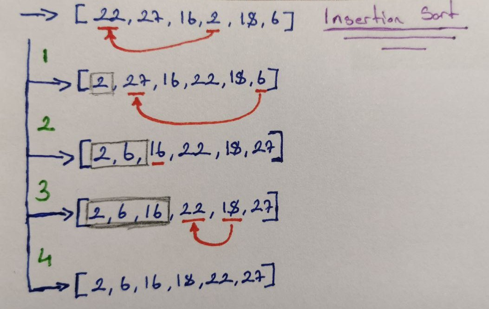

# **Insertion Sort Projesi**
[Patika](https://app.patika.dev), Veri Yapıları ve Algoritmalar kursu projelerinden Insertion Sort Projesi.

<br/>


## **Proje İsterleri**

```[22,27,16,2,18,6]``` __-->__ **Insertion Sort**

- Yukarı verilen dizinin sort türüne göre aşamalarını yazınız.
- Big-O gösterimini yazınız.
- Time Complexity: Average case: Aradığımız sayının ortada olması,
- Worst case: Aradığımız sayının sonda olması,
- Best case: Aradığımız sayının dizinin en başında olması.
- Dizi sıralandıktan sonra 18 sayısı hangi case kapsamına girer? Yazınız.


**```[7,3,5,8,2,9,4,15,6]```** dizisinin Insertion Sort'a göre ilk ```4``` adımını yazınız.


### **Aşamalar:**
  1. Aşama ```-->``` [2, |27, 16, 22, 18, 6]
  2. Aşama ```-->``` [2, 6, |16, 22, 18, 27] 
  3. Aşama ```-->``` [2, 6, 16, |22, 18, 27] 
  4. Aşama ```-->``` [2, 6, 16, 18, 22, 27] 

<br/>



### **Big-O Gösterimi:**

    n + (n-1) + (n-2) + ---- + 1 = (n.(n+1))/2 = n^2/2 + n/2

    = O(n^2)


### **Time Complexity:**

    Worst Case: [27,22,18,16,6,2] 
    Best Case: [2,6,16,18,22,27]

### **18 Sayısının Case Durumu**

    [2, 6, 16, 18, 22, 27]

    (n-3) 

    Average Case

---
## **_[7, 3, 5, 8, 2, 9, 4, 15, 6]_ İlk *4* Adımı:**

  1. Aşama ```-->``` [2, |3, 5, 8, 7, 9, 4, 15, 6]
  2. Aşama ```-->``` [2, 3, |5, 8, 7, 9, 4, 15, 6]
  3. Aşama ```-->``` [2, 3, 4, |8, 7, 9, 5, 15, 6]
  4. Aşama ```-->``` [2, 3, 4, 5, |7, 9, 8, 15, 6]